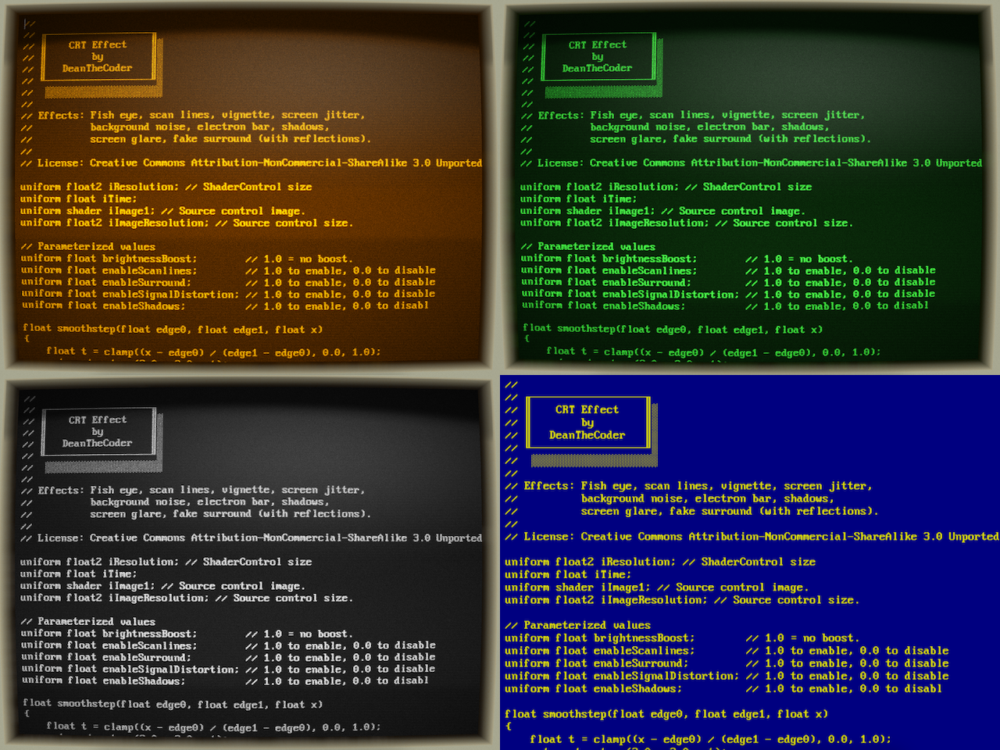

# CrtTextBox

**CrtTextBox** is an Avalonia C# project that enhances a standard TextBox control with a custom SKSL shader, giving it the appearance of a retro CRT screen. This effect adds a nostalgic touch to your UI with features like fish-eye distortion, scan lines, vignette, screen jitter, background noise, and a scrolling electron bar.

It makes use of a custom `ShaderControl` control, allowing any SKSL shader code to be applied to a source Avalonia UI control.
The `CrtTextBox` example demonstrate how to use it with a `TextBox`, but any other source control can be used.

## Features

- **Retro CRT Look**: The shader applies various effects to create a convincing retro CRT display, including:
  - Fish-eye distortion
  - Scan lines
  - Vignette effect
  - Screen jitter
  - Background noise
  - Scrolling electron bar
  - Monitor 'surround' with screen reflection

- **Cross-Platform Compatibility**: Built with [Avalonia](https://avaloniaui.net/), ensuring compatibility across Windows, MacOS, and Linux.

- **Customizable**: The shader can be easily integrated into any Avalonia application and modified to suit different visual styles.

## Getting Started

### Prerequisites

- .NET compatible IDE such as [JetBrains Rider](https://www.jetbrains.com/rider/) or [Visual Studio 2022](https://visualstudio.microsoft.com/vs/).
- Basic knowledge of C# and Avalonia UI.

### Building From Source

1. Clone the repository from GitHub.
2. Open the solution in your IDE.
3. Build and run the project.

### Using the Text Editor

The main view is taken up with the shader code itself. Feel free to modify it and press `F5` to apply changes. Right-click outside of the text area to switch Themes.

### Create Your Own Theme

Check out the `Themes` folder in the source tree. Modify the code to toggle features, or create your own theme from scratch.

### Using the `ShaderControl`

The `ShaderControl` object is a standalone class and can be copied into your own project, and applied to any control with any shader code.

1. Add `ShaderControl` to your AXAML.
2. From the code-behind, set the `ControlSource` property to the UI control you wish to apply the shader to.
3. Set the `FPS` property, which determines the frequency the source control is sampled.
4. Set `ShaderUri` to point to the location of your SKSL shader code. Use `crt.sksl` as a reference.

Custom `uniform` values can be passed into the shader code using `ShaderControl.AddUniform(name, value)`.

## Contribution and Improvements

CrtTextBox is an open-source project, and contributions are welcome. If you have ideas for new features, improvements, or bug fixes, feel free to submit a pull request. Please note that this is a side project, so responses might not be immediate.

## Credits

* Created with help from the blog: [Avalonia with Fragment Shaders](https://avaloniaui.net/blog/avalonia-with-fragment-shaders)
* ...based on work by [Wiesław Šoltés](https://github.com/wieslawsoltes/EffectsDemo).

The project is licensed under the Creative Commons Attribution-NonCommercial-ShareAlike 3.0 Unported License.

## Useful Resources

- [Avalonia UI Documentation](https://docs.avaloniaui.net/)
- [SKSL Shader Language](https://skia.org/docs/user/sksl/)
- [The Oldschool PC Font Resource](https://int10h.org/oldschool-pc-fonts/fontlist/font?ibm_vga_8x16)

---

Follow me on Twitter for more updates: [@deanthecoder](https://twitter.com/deanthecoder).
